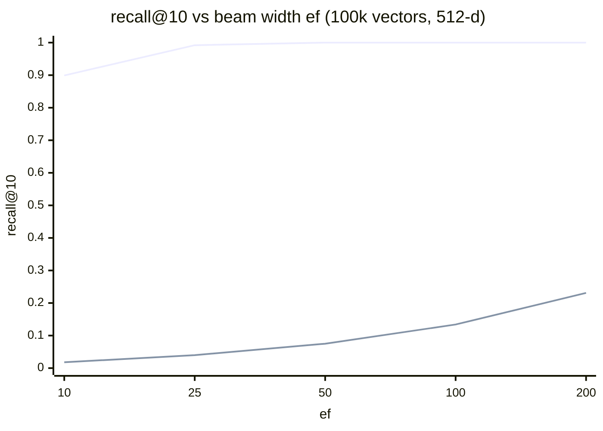

# EdgeVector

A header-only C++17 vector search library for edge devices: **binary
quantization + HNSW + memory-mapped storage** in three headers, ~1,600 lines,
zero dependencies.

- **32x smaller vectors** — 512-d float32 (2,048 B) quantizes to 64 B, with a
  proven SimHash cosine estimator (MAE 0.033, Pearson r 0.997 vs float32)
- **Zero-allocation queries** — all search memory is pre-allocated; enforced
  in CI-style tests by an instrumented global `operator new` that must count
  **zero** allocations across searches
- **Zero-copy startup** — vectors are `mmap`ed straight from disk and the
  prebuilt graph loads in ~0.1 s where rebuilding takes ~97 s (100k vectors)
- **Validated on Linux (POSIX mmap) and Windows (MinGW-w64)**, debug and
  `-DNDEBUG` release, always under `-O3 -march=native -Wall -Wextra -Werror`

## Measured performance

100,000 × 512-d vectors, M = 16, ef_construction = 200, k = 10, **single
thread** (i7-1355U, WSL2/Linux, g++ 13, `-O3 -march=native -DNDEBUG`).
Reproduce with `make -C tests bench`.

### Clustered data (embedding-like, 1,000 clusters)

| ef | recall@10 | mean latency | QPS (1 thread) | vs exact scan |
|---|---|---|---|---|
| 10 | 0.899 | 36 µs | 27,599 | 27.4x |
| 25 | 0.992 | 83 µs | 12,087 | 12.0x |
| 50 | 1.000 | 216 µs | 4,621 | 4.6x |
| 100 | 1.000 | 412 µs | 2,426 | 2.4x |

| | |
|---|---|
| Quantized vectors | 6.4 MB (float32 equivalent: 204.8 MB — 32x) |
| Graph links + scratch | 15.0 MB |
| Build (one-time, 1 thread) | 96.7 s |
| Load prebuilt graph at startup | 0.10 s (~950x faster than rebuilding) |



### The honest caveat: iid random data

The benchmark also runs a second scenario — 100k **structureless iid
Gaussian** vectors — where recall@10 is only 0.13 at ef = 100. That is not a
defect of this library: with no manifold to exploit, high-dimensional
distances concentrate (σ/µ ≈ 4% at 512 bits) and *every* ANN index degrades
toward brute force; it is the known adversarial case, and it is why standard
ANN benchmarks use real embeddings rather than noise. Real embedding data
behaves like the clustered scenario. Both tables ship in the benchmark so you
can judge for yourself.

## Quick start

Everything is three `#include`s; no linking, no build step for the library
itself.

```cpp
#include "edgevector/quantize_math.hpp"
#include "edgevector/mmap_storage.hpp"
#include "edgevector/hnsw_graph.hpp"
using namespace edgevector;

const std::size_t dim = 512;
const std::uint32_t n  = /* vector count */;
const std::size_t rb   = padded_bytes(dim);   // 64 bytes at dim = 512

// ---- Index build (offline, allocation allowed) --------------------------
std::vector<std::uint64_t> buf((rb / 8) * n);          // 8-byte aligned block
auto* base = reinterpret_cast<std::uint8_t*>(buf.data());
for (std::uint32_t i = 0; i < n; ++i)
    quantize(float_vectors[i], dim, base + i * rb);    // bit i = (x[i] > 0)
write_storage_file("index.evec", dim, n, base);

HNSWGraph builder(base, rb, dim, n);                   // M=16, efC=200 defaults
for (std::uint32_t i = 0; i < n; ++i) builder.insert(i);
builder.save_graph("index.evhg");

// ---- Device startup (no rebuild: map vectors, load graph) ---------------
MMapStorage store;
store.open("index.evec");                              // zero-copy mmap
HNSWGraph graph(store.vector(0), store.record_bytes(),
                static_cast<std::size_t>(store.dim()),
                static_cast<std::uint32_t>(store.count()));
graph.load_graph("index.evhg");                        // ~0.1 s at 100k

// ---- Query (hot path: zero allocation, noexcept) ------------------------
alignas(8) std::uint8_t q[64];
quantize(query_floats, dim, q);
SearchResult out[10];
const std::uint32_t found = graph.search(q, /*k=*/10, /*ef=*/50, out);
// out[0..found) sorted ascending by (Hamming distance, id)
```

## Architecture

| Header | Role |
|---|---|
| `quantize_math.hpp` | float32 → 1 bit/component sign quantization; Hamming distance over `uint64_t` words via `__builtin_popcountll`; SimHash cosine estimator `cos(π·h/d)` |
| `mmap_storage.hpp` | Validated on-disk vector format (`EVEC` v1) and a zero-copy, read-only `mmap` reader. POSIX primary; Win32 shim confined to `detail::` for development |
| `hnsw_graph.hpp` | HNSW (Malkov & Yashunin) over the quantized block: build, heuristic neighbor selection with keep-pruned backfill, zero-allocation beam search, and a validated graph persistence format (`EVHG` v1) |

Engineering rules the code holds itself to (and tests enforce):

- **No allocation on the query path.** Visited-epoch array, candidate
  min-heap, and result max-heap are pre-allocated pools; heaps are raw arrays
  with explicit size counters. The test suites replace global `operator new`
  and fail if a single allocation occurs during search — including searches
  served directly from an `mmap`ed file.
- **No aliasing tricks.** Bytes cross into `uint64_t` via `std::memcpy` only
  (compiles to a plain load at `-O3`); on-disk headers are never
  `reinterpret_cast` to structs.
- **Deterministic ordering.** All comparisons tie-break by (distance, id), so
  results are reproducible and exactly comparable to a brute-force baseline.
- **Every failure is a status value.** No exceptions; a failed graph load
  leaves the graph empty, never half-populated, and every load is fully
  validated (magic, version, parameter compatibility, per-node level/count
  bounds, referential integrity of every edge, exact file length).

Formats are little-endian and documented byte-by-byte in the headers.

## Build and test

Requires g++ or clang with C++17 (uses `__builtin_popcountll`; MSVC not
supported). Linux, WSL, or MinGW-w64 on Windows.

```sh
cd tests
make run          # 4 test suites, asserts enabled
make run-release  # same suites under -DNDEBUG
make bench        # the 100k benchmark reported above (-DNDEBUG, ~5 min)
```

The suites cover: quantization bit-exactness and padding hygiene, cosine
parity gates, storage round-trips and header-corruption rejection, mapped
record alignment, HNSW recall gates at two scales, result ordering, graph
persistence round-trips (bitwise-identical search results after reload), and
the zero-allocation proof.

## Status and roadmap

v0.2. Solid: everything above. Known limitations, in priority order:

1. **Insert-only** — no delete/update; capacity fixed at construction
2. **Single-threaded queries** — scratch pools live in the graph, so one
   query at a time per instance (per-thread search contexts planned)
3. **No float32 re-ranking stage** — retrieving with binary distance then
   re-ranking top candidates with exact float distance is the standard recipe
   for recall on hard data; not implemented yet
4. **x86-validated only** — the target niche is ARM edge devices, but ARM
   builds (NEON `popcount`) have not been exercised yet

If you need a mature production system in this space today, look at
[USearch](https://github.com/unum-cloud/usearch) or
[Faiss](https://github.com/facebookresearch/faiss)'s `IndexBinaryHNSW`.
EdgeVector's niche is the opposite trade: a codebase small enough to read in
an afternoon, audit completely, and vendor into firmware-style projects where
every dependency is a liability.

## Development process

This library was built with an AI-agent workflow — an overseer model
(Claude) planning, specifying, and adversarially reviewing; worker agents
implementing against strict gates — with every module required to pass
measured, machine-checked acceptance criteria (parity thresholds, recall
gates, an instrumented allocator) before merging. The working documents
(`CLAUDE.md`, `PLAN.md`) are checked in unedited, as part of the record.

## License

[MIT](LICENSE)
