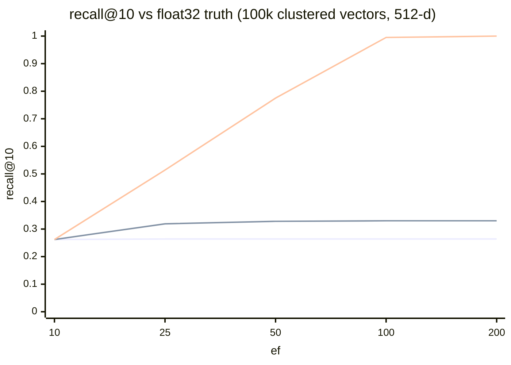

# EdgeVector

A header-only C++17 vector search library for edge devices: **binary
quantization + HNSW + memory-mapped storage** in three headers, ~2,000 lines,
zero dependencies — with a two-stage retrieval pipeline that reaches
**float32-exact accuracy from a 32x-compressed RAM index**.

- **32x smaller vectors in RAM** — 512-d float32 (2,048 B) quantizes to 64 B
- **recall@10 = 0.995–1.000 against true float32 ground truth** (embedding-like
  data, 100k vectors) via exact re-ranking, while RAM holds only the codes —
  the full-precision vectors can stay on flash and each query touches just
  `ef` of them
- **Zero-allocation queries, proven** — every search mode is covered by tests
  that replace the global `operator new` and require **zero** allocations
- **Concurrent queries and concurrent construction** — per-thread
  `SearchContext` scratch pools for queries, and a striped-lock parallel
  build: 100k vectors in **7.9 s on 12 threads vs 64.3 s serial (8.1x)**,
  validated by a full referential-integrity sweep after every parallel build
- **Soft deletion, filtered search, and slot reclamation** — tombstones plus
  caller-supplied allow-bitmaps, composable, persisted in the graph file; a
  tombstoned slot can be reclaimed for a brand-new vector in ~2.9 ms at 100k
  (`remove` → overwrite bytes → `reinsert`), leaving zero dangling edges by
  construction
- **~0.05 s startup at 100k vectors** — mmap the codes, load the prebuilt
  graph (~1,400x faster than rebuilding)
- **Learned ITQ rotation** for anisotropic (real-embedding-shaped) data:
  +21 recall points at the same beam width, or the same accuracy at a
  fraction of the compute — while preserving cosine exactly
- **Validated on Linux (POSIX mmap), Windows (MinGW-w64), and AArch64**
  (all suites pass under QEMU emulation with native arm64 g++; the Hamming
  kernel compiles to NEON `cnt`), debug and `-DNDEBUG` release, always under
  `-O3 -Wall -Wextra -Werror`

## The accuracy architecture

Ranking by Hamming distance alone is coarse: distances are small integers
with massive ties, and 1-bit codes discard the query's magnitudes. EdgeVector
layers three search modes over one Hamming-navigated graph:

| Mode | Ranks by | Extra memory | Use when |
|---|---|---|---|
| `search()` | Hamming distance | none | binary similarity is the target metric |
| `search_reranked()` | **asymmetric score** `dot(q_float, sign(x))`, ADC-style per-byte tables | none (64 KB per-query table, pre-allocated) | float query available, floats for the corpus are not |
| `search_exact_reranked()` | **true float32 cosine** over the ef-candidate pool | corpus floats readable (flash/mmap is the intent; ~`ef`·dim·4 bytes touched per query) | you want float-exact results from a code-sized RAM index |

## Measured performance

100,000 × 512-d vectors, M = 16, ef_construction = 200, k = 10, **single
thread** (i7-1355U, WSL2/Linux, g++ 13, `-O3 -march=native -DNDEBUG`).
Recall is measured against **exact float32 cosine ground truth** — the number
an application actually experiences — and against exact binary ground truth
(the graph in isolation). Reproduce with `make -C tests bench`.

### Clustered data (embedding-like, 1,000 clusters)

| ef | recall@10 (binary GT) | float GT, Hamming rank | float GT, asym re-rank | float GT, **exact re-rank** | lat Hamming | lat asym | lat exact |
|---|---|---|---|---|---|---|---|
| 10 | 0.899 | 0.262 | 0.262 | **0.262** | 28 µs | 53 µs | 57 µs |
| 25 | 0.992 | 0.264 | 0.319 | **0.514** | 79 µs | 109 µs | 131 µs |
| 50 | 1.000 | 0.264 | 0.328 | **0.775** | 126 µs | 219 µs | 343 µs |
| 100 | 1.000 | 0.264 | 0.330 | **0.995** | 295 µs | 299 µs | 494 µs |
| 200 | 1.000 | 0.264 | 0.330 | **1.000** | 534 µs | 595 µs | 985 µs |

Read the last column: **~2,000 QPS single-thread at 99.5% float-exact
recall** from a RAM index 32x smaller than the float vectors. The graph
itself is essentially perfect (binary-GT recall 1.000 from ef = 50); the
Hamming-rank column shows the 1-bit representation ceiling that re-ranking
removes.

| | |
|---|---|
| Quantized vectors (RAM) | 6.4 MB (float32 equivalent: 204.8 MB — 32x) |
| Graph links + scratch | 15.0 MB |
| Build (one-time): 1 thread / 12 threads | 64.3 s / **7.9 s** (8.1x, integrity-validated) |
| Reclaim one slot (remove + relink new vector) | **2.9 ms** (avg of 100, integrity-validated) |
| Load prebuilt graph at startup | 0.035 s (~1,800x faster than rebuilding) |



### The honest caveat: iid random data

The benchmark's second scenario is 100k **structureless iid Gaussian**
vectors — the known adversarial case for *every* ANN index: with no manifold
to exploit, high-dimensional distances concentrate (σ/µ ≈ 4% at 512 bits)
and graph navigation loses its gradient.

| ef | recall@10 (binary GT) | float GT, Hamming rank | float GT, asym re-rank | float GT, **exact re-rank** |
|---|---|---|---|---|
| 50 | 0.075 | 0.016 | 0.026 | **0.030** |
| 100 | 0.134 | 0.024 | 0.046 | **0.061** |
| 200 | 0.231 | 0.034 | 0.071 | **0.110** |

Low absolute numbers here are the nature of the data, not a defect (it is why
standard ANN benchmarks use real embeddings rather than noise) — but note the
re-ranking ladder still triples the float-truth recall at every beam width.
Real embedding data behaves like the clustered scenario. Both tables ship in
the benchmark so you can judge for yourself.

### ITQ rotation: better bits for anisotropic data

Sign quantization spends exactly one bit per dimension, but real embedding
spectra decay — most of the energy lives in a few directions, so most bits
measure noise. `itq_rotation.hpp` implements **Iterative Quantization**
(Gong & Lazebnik, 2011): a learned orthogonal rotation that spreads variance
evenly across dimensions before quantizing. Deliberately rotation-only — no
centering, no PCA — so **cosine similarity is preserved exactly**: float32
ground truth is unchanged, and `search_exact_reranked()` can re-rank with the
*original* floats and query even over a rotated index.

Measured at 50k × 512-d vectors with an `exp(-4d/512)` decaying spectrum
(recall@10 vs float32 truth; rotation trained on a 5k subsample in 21 s,
orthogonality residual 1.2e-8):

| ef | raw Hamming | **ITQ Hamming** | raw asym | **ITQ asym** | raw exact | **ITQ exact** |
|---|---|---|---|---|---|---|
| 25 | 0.290 | **0.500** | 0.389 | **0.569** | 0.619 | **0.846** |
| 100 | 0.290 | **0.500** | 0.418 | **0.570** | 1.000 | **1.000** |

Two readings: at fixed ef the codes get much better (+21 points on Hamming
ranking); at fixed accuracy the exact-re-rank pipeline needs a far narrower
beam (0.846 at ef = 25 vs 0.619 without). Training is deterministic for a
fixed seed — bit-identical matrices, verified across x86-64 and AArch64 —
and the polar-decomposition solver (inverse-free Newton–Schulz, double
precision, spectrally pre-scaled) reports failure rather than silently
degrading. The `EVRT` rotation file format validates magic, version,
dimension, exact length, finiteness, and orthogonality on load.

## Quick start

Everything is three `#include`s; no linking, no build step for the library
itself.

```cpp
#include "edgevector/quantize_math.hpp"
#include "edgevector/mmap_storage.hpp"
#include "edgevector/hnsw_graph.hpp"
using namespace edgevector;

const std::size_t dim = 512;
const std::uint32_t n  = /* vector count */;
const std::size_t rb   = padded_bytes(dim);   // 64 bytes at dim = 512

// ---- Index build (offline, allocation allowed) --------------------------
std::vector<std::uint64_t> buf((rb / 8) * n);          // 8-byte aligned block
auto* base = reinterpret_cast<std::uint8_t*>(buf.data());
for (std::uint32_t i = 0; i < n; ++i)
    quantize(float_vectors[i], dim, base + i * rb);    // bit i = (x[i] > 0)
write_storage_file("index.evec", dim, n, base);

HNSWGraph builder(base, rb, dim, n);                   // M=16, efC=200 defaults
std::vector<std::uint32_t> ids(n);
std::iota(ids.begin(), ids.end(), 0u);
builder.insert_batch(ids.data(), n, 0);                // 0 = all hardware threads
// (or serial, deterministic: for (auto id : ids) builder.insert(id);)
builder.save_graph("index.evhg");

// ---- Device startup (no rebuild: map codes, load graph) -----------------
MMapStorage store;
store.open("index.evec");                              // zero-copy mmap
HNSWGraph graph(store.vector(0), store.record_bytes(),
                static_cast<std::size_t>(store.dim()),
                static_cast<std::uint32_t>(store.count()));
graph.load_graph("index.evhg");                        // ~0.05 s at 100k

// ---- Query (hot path: zero allocation, noexcept) ------------------------
alignas(8) std::uint8_t q[64];
quantize(query_floats, dim, q);

SearchResult by_hamming[10];
graph.search(q, /*k=*/10, /*ef=*/50, by_hamming);

// Float-exact results while RAM holds only the codes: `corpus_floats` can be
// your own read-only mmap of the raw float file - each query touches just
// the ef candidates it re-ranks.
ScoredResult best[10];
graph.search_exact_reranked(q, query_floats, corpus_floats, dim,
                            /*k=*/10, /*ef=*/100, best);

// ---- Concurrency, deletion, filtering -----------------------------------
SearchContext ctx = graph.make_context();  // one per querying thread
graph.search(ctx, q, 10, 50, by_hamming);  // thread-safe on a const graph

graph.remove(42);                          // tombstone: gone from results,
graph.restore(42);                         //   still routes; persisted (v2)

// Slot reclamation: replace a dead slot's vector with a brand-new one.
graph.remove(42);
quantize(new_floats, dim, base + 42 * rb); // caller overwrites the bytes...
graph.reinsert(42);                        // ...then the graph relinks: ~3 ms
                                           //   at 100k, no dangling edges

std::vector<std::uint64_t> allow((n + 63) / 64, 0);
// ... set one bit per permitted id ...
graph.search(ctx, q, 10, 50, by_hamming, allow.data());

// ---- Optional: ITQ rotation for anisotropic embedding data --------------
#include "edgevector/itq_rotation.hpp"
ItqRotation rot(dim);
rot.train(corpus_floats, n, dim);          // offline; deterministic per seed
rot.save("rotation.evrt");                 // ship next to the index files
// Index build: quantize rotated vectors; query: rotate first, then quantize.
std::vector<float> tmp(dim);
rot.rotate_quantize(query_floats, tmp.data(), q);
// exact re-rank still takes the ORIGINAL floats: rotation preserves cosine.
```

## Architecture

| Header | Role |
|---|---|
| `quantize_math.hpp` | float32 → 1 bit/component sign quantization; Hamming distance over `uint64_t` words via `__builtin_popcountll`; SimHash cosine estimator; **asymmetric ADC scorer** (per-byte lookup tables for `dot(q_float, sign(x))`) |
| `mmap_storage.hpp` | Validated on-disk vector format (`EVEC` v1) and a zero-copy, read-only `mmap` reader. POSIX primary; Win32 shim confined to `detail::` for development |
| `hnsw_graph.hpp` | HNSW (Malkov & Yashunin) over the quantized block: build with heuristic neighbor selection + keep-pruned backfill; three zero-allocation search modes; per-thread `SearchContext`s; soft-delete tombstones and allow-bitmap filtering; validated graph persistence (`EVHG` v2, loads v1) |
| `itq_rotation.hpp` | Learned ITQ rotation (rotation-only, cosine-preserving): double-precision training with an inverse-free Newton–Schulz Procrustes solver; allocation-free `rotate()`/`rotate_quantize()`; validated `EVRT` persistence |

Engineering rules the code holds itself to (and tests enforce):

- **No allocation on the query path.** Visited-epoch arrays, both heaps, the
  ADC table, and the re-rank buffer are pre-allocated in the `SearchContext`;
  heaps are raw arrays with explicit size counters. The test suites replace
  the global `operator new` and fail if a single allocation occurs in any
  search mode — including searches served directly from an `mmap`ed file.
- **No aliasing tricks.** Bytes cross into `uint64_t` via `std::memcpy` only;
  on-disk headers are never `reinterpret_cast` to structs.
- **Deterministic ordering.** All comparisons tie-break by (distance, id) —
  or (score, id) after re-ranking — so results are reproducible and exactly
  comparable to brute-force baselines.
- **Every failure is a status value.** No exceptions; a failed graph load
  leaves the graph empty, never half-populated, and every load is fully
  validated (magic, version, parameter compatibility, per-node level/count
  bounds, referential integrity of every edge, tombstone integrity, exact
  file length).

Formats are little-endian and documented byte-by-byte in the headers.

## Build and test

Requires g++ or clang with C++17 (uses `__builtin_popcountll`; MSVC not
supported). Linux, WSL, or MinGW-w64 on Windows.

```sh
cd tests
make run          # 5 test suites, asserts enabled
make run-release  # same suites under -DNDEBUG
make bench        # the benchmarks reported above (-DNDEBUG; pass a scenario
                  # to the binary: ./benchmark_100k clustered|random|itq)
```

The suites cover: quantization bit-exactness and padding hygiene, cosine
parity gates, ADC-table exactness against a naive `dot(q, sign(x))`, storage
round-trips and header-corruption rejection, mapped record alignment, HNSW
recall gates at two scales, result ordering, the re-ranking accuracy ladder
against float32 ground truth, graph persistence round-trips (bitwise-identical
results and surviving tombstones after reload), context isolation plus a
4-thread concurrency test, delete/restore/filter composition, slot
reclamation (new-vector serving, no-dangling-edge integrity after churn of
100 slots, full entry-point turnover, single-node bootstrap), ITQ invariants
(orthogonality, exact cosine preservation, monotone objective, determinism,
hostile-file rejection, end-to-end recall gain), concurrent construction
(single-thread batch bit-identical to serial insert; 4-thread build passing
the full referential-integrity sweep and the recall gate), and the
zero-allocation proof for all three search modes.

**AArch64:** `tests/arm64.Dockerfile` reproduces the ARM validation — all
five suites compiled by native arm64 g++ 13 at `-march=armv8-a -Werror` and
executed under QEMU user-mode emulation, with the Hamming kernel confirmed to
compile to NEON `cnt` (vector popcount) instructions. Emulated timings are
meaningless, so ARM *performance* claims wait for real silicon; correctness —
including bit-identical ITQ training results vs x86-64 — is validated.

## Status and roadmap

v0.6. Known limitations, in priority order:

1. **Capacity is fixed at construction** — slots can now be reclaimed for
   new vectors (`remove` → overwrite → `reinsert`, ~2.9 ms each at 100k,
   serial-only, O(total links) per reclaim by design: exhaustive unlinking
   over heuristic repair), but the total slot count cannot grow
2. **Highly selective filters degrade** toward a scan of the reachable graph
   (true of every filtered-HNSW implementation; documented, not hidden)
3. **ARM validated for correctness, not yet for performance** — all suites
   pass on aarch64 under QEMU emulation (including the 4-thread build and
   query tests) with NEON popcount codegen confirmed, but latency/QPS
   numbers on real ARM silicon are still pending; QEMU on an x86 host also
   only partially exercises ARM's weaker memory model (the build's
   correctness rests on mutex ordering, not x86 TSO, by design)
4. **Parallel builds are nondeterministic** in link structure (insertion
   order interleaves); use serial `insert()` or `insert_batch(..., 1)` when
   bit-reproducible graphs matter

If you need a mature production system in this space today, look at
[USearch](https://github.com/unum-cloud/usearch) or
[Faiss](https://github.com/facebookresearch/faiss)'s `IndexBinaryHNSW`.
EdgeVector's niche is the opposite trade: a codebase small enough to read in
an afternoon, audit completely, and vendor into firmware-style projects where
every dependency is a liability — now with a retrieval pipeline that gives up
none of the accuracy.

## Development process

This library was built with an AI-agent workflow — an overseer model
(Claude) planning, specifying, and adversarially reviewing; worker agents
implementing against strict gates — with every module required to pass
measured, machine-checked acceptance criteria (parity thresholds, recall
gates, an instrumented allocator) before merging. The working documents
(`CLAUDE.md`, `PLAN.md`) are checked in unedited, as part of the record.

## License

[MIT](LICENSE)
